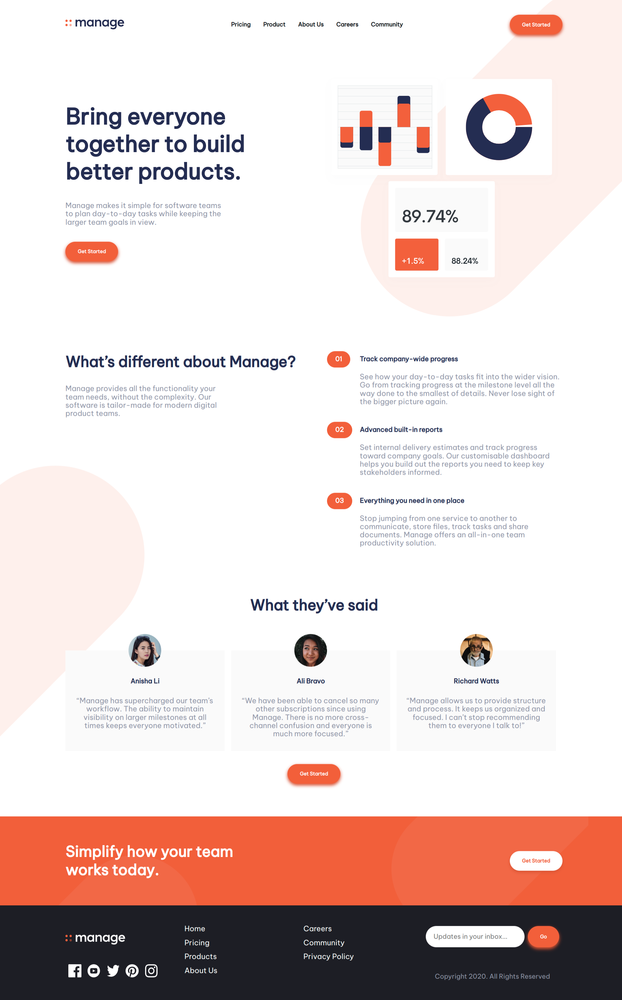
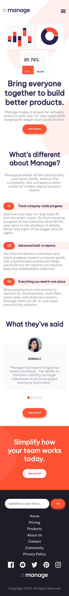

# Frontend Mentor - Manage landing page solution

This is a solution to the [Manage landing page challenge on Frontend Mentor](https://www.frontendmentor.io/challenges/manage-landing-page-SLXqC6P5). Frontend Mentor challenges help you improve your coding skills by building realistic projects.

## Table of contents

- [Overview](#overview)
  - [The challenge](#the-challenge)
  - [Screenshot](#screenshot)
  - [Links](#links)
- [My process](#my-process)
  - [Built with](#built-with)
- [Author](#author)

## Overview

### The challenge

Users should be able to:

- View the optimal layout for the site depending on their device's screen size
- See hover states for all interactive elements on the page
- See all testimonials in a horizontal slider

### Screenshot

Desktop

Mobile

### Links

- Solution URL: [HERE](https://www.frontendmentor.io/solutions/responsive-layout-using-plain-css-PGAO1B-oxi)
- Live Site URL: [https://manage.raelcode.com](https://manage.raelcode.com)

## My process

### Built with

- Semantic HTML5 markup
- CSS
- Flexbox
- CSS Grid
- Mobile-first workflow
- Vite - For module bundling
- Vanilla Javascript
- Netlify - For hosting

## Author

- Frontend Mentor - [@kibzrael](https://www.frontendmentor.io/profile/kibzrael)
- Twitter - [@kibzrael](https://www.twitter.com/kibzrael)
